# Meal Planner App Architecture Documentation

## Table of Contents
1. [Complete System Description](#complete-system-description)
2. [Model Layer](#model-layer)
3. [Main Activity](#main-activity)
4. [Home Feature](#home-feature)
5. [Login Feature](#login-feature)
6. [Registration Feature](#registration-feature)
7. [Favorites Feature](#favorites-feature)
8. [Planner Feature](#planner-feature)
9. [Meal Detail Feature](#meal-detail-feature)
10. [Navigation System ](#navigation-system)
11. [Network Status & Caching System](#network-status--caching-system)
12. [Session Manager ](#session-manager)
13. [ Profile Feature](#profile-feature)
14. [Search Feature ](#search-feature)

---

## GustoGuru - Complete Architecture Overview
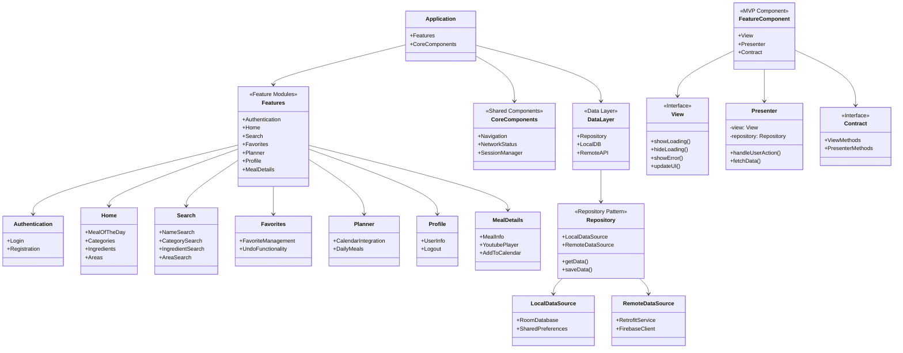
```mermaid
%%{init: {'theme': 'default', 'themeVariables': { 
  'background': '#ffffff',
  'primaryColor': '#ffffff',
  'actorBorder': '#333333',
  'actorTextColor': '#333333',
  'noteTextColor': '#333333',
  'signalColor': '#333333',
  'signalTextColor': '#333333',
  'sequenceNumberColor': '#333333',
  'fontFamily': '"Times New Roman", serif'
}}}%%
classDiagram
    %% Main Components
    class Application {
        +Features
        +CoreComponents
    }
    
    class Features {
        <<Feature Modules>>
        +Authentication
        +Home
        +Search
        +Favorites
        +Planner
        +Profile
        +MealDetails
    }
    
    class CoreComponents {
        <<Shared Components>>
        +Navigation
        +NetworkStatus
        +SessionManager
    }
    
    class DataLayer {
        <<Data Layer>>
        +Repository
        +LocalDB
        +RemoteAPI
    }
    
    Application --> Features
    Application --> CoreComponents
    Application --> DataLayer
    
    %% Feature Breakdown
    class Authentication {
        +Login
        +Registration
    }
    
    class Home {
        +MealOfTheDay
        +Categories
        +Ingredients
        +Areas
    }
    
    class Search {
        +NameSearch
        +CategorySearch
        +IngredientSearch
        +AreaSearch
    }
    
    class Favorites {
        +FavoriteManagement
        +UndoFunctionality
    }
    
    class Planner {
        +CalendarIntegration
        +DailyMeals
    }
    
    class Profile {
        +UserInfo
        +Logout
    }
    
    class MealDetails {
        +MealInfo
        +YoutubePlayer
        +AddToCalendar
    }
    
    Features --> Authentication
    Features --> Home
    Features --> Search
    Features --> Favorites
    Features --> Planner
    Features --> Profile
    Features --> MealDetails
    
    %% MVP Structure
    class FeatureComponent {
        <<MVP Component>>
        +View
        +Presenter
        +Contract
    }
    
    class View {
        <<Interface>>
        +showLoading()
        +hideLoading()
        +showError()
        +updateUI()
    }
    
    class Presenter {
        -view: View
        -repository: Repository
        +handleUserAction()
        +fetchData()
    }
    
    class Contract {
        <<Interface>>
        +ViewMethods
        +PresenterMethods
    }
    
    FeatureComponent --> View
    FeatureComponent --> Presenter
    FeatureComponent --> Contract
    
    %% Data Flow
    class Repository {
        <<Repository Pattern>>
        +LocalDataSource
        +RemoteDataSource
        +getData()
        +saveData()
    }
    
    class LocalDataSource {
        +RoomDatabase
        +SharedPreferences
    }
    
    class RemoteDataSource {
        +RetrofitService
        +FirebaseClient
    }
    
    DataLayer --> Repository
    Repository --> LocalDataSource
    Repository --> RemoteDataSource

```

# Complete System Description

## 1. Architectural Layers

### Presentation Layer (MVP)

- **Views**: Fragments/Activities implementing View interfaces  
- **Presenters**: Business logic handlers for each feature  
- **Contracts**: Interfaces defining View-Presenter communication  
- **Adapters**: RecyclerView adapters for list displays  

### Domain Layer

- **Use Cases**: Encapsulated business rules (handled by Presenters)  
- **Models**: POJOs representing app data (Meal, Category, etc.)  
- **Repositories**: Single source of truth for data (`MealRepository`)  

### Data Layer

- **Local**:
  - Room Database (`AppDatabase`)  
  - SharedPreferences (`SessionManager`)  

- **Remote**:
  - MealDB API (Retrofit)  
  - Firebase (Authentication/Sync)  

## 2. Key Features Implementation

| Feature        | Components                                        | Description                                           |
|----------------|---------------------------------------------------|-------------------------------------------------------|
| Authentication | `LoginPresenter`, `RegistrationPresenter`         | Handles user auth via Email/Google/Facebook           |
| Home           | `HomePresenter`, Category/Area/Ingredient Adapters | Shows meal of day and browse categories               |
| Search         | `SearchPresenter`, `SuggestionAdapter`            | Multi-criteria search with real-time suggestions      |
| Favorites      | `FavoritesPresenter`, Undo functionality          | Manage favorites with snackbar undo                   |
| Planner        | `PlannedPresenter`, `CalendarManager`             | Weekly meal planning with calendar integration        |
| Profile        | `ProfilePresenter`, Name editing                  | User profile management                               |
| Meal Details   | `MealDetailPresenter`, `YouTubePlayer`            | Detailed meal view with cooking instructions          |

## 3. Data Flow

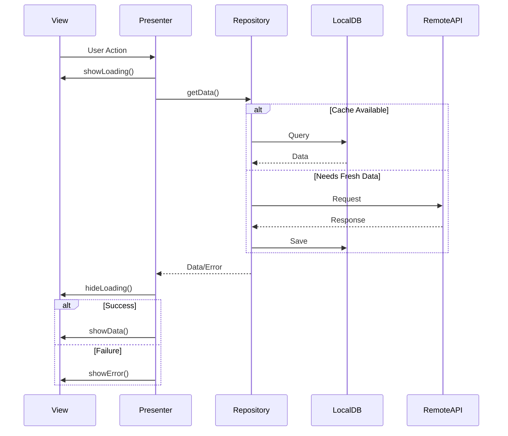
```mermaid
sequenceDiagram
    participant View
    participant Presenter
    participant Repository
    participant LocalDB
    participant RemoteAPI
    
    View->>Presenter: User Action
    Presenter->>View: showLoading()
    Presenter->>Repository: getData()
    alt Cache Available
        Repository->>LocalDB: Query
        LocalDB-->>Repository: Data
    else Needs Fresh Data
        Repository->>RemoteAPI: Request
        RemoteAPI-->>Repository: Response
        Repository->>LocalDB: Save
    end
    Repository-->>Presenter: Data/Error
    Presenter->>View: hideLoading()
    alt Success
        Presenter->>View: showData()
    else Failure
        Presenter->>View: showError()
    end

```

## 4. Core Components

### SessionManager

- Manages user sessions  
- Stores authentication state  
- Caches meal of the day  

### NetworkStatus

- Monitors connectivity  
- Shows online/offline status  
- Integrates with `CacheInterceptor`  

### Navigation

- BottomNav handling  
- Protected route management  
- Fragment navigation  

---

## 5. Design Patterns Used

### MVP (Model-View-Presenter)

- Separation of concerns  
- Testable presenters  
- View interfaces for abstraction  
## This architecture provides:

- Clear separation of concerns  
- Scalable feature addition  
- Testable components  
- Offline support  
- Consistent user experience  

---

## The MVP implementation ensures:

- Views remain dumb/passive  
- Presenters contain business logic  
- Easy mocking for testing  
- Lifecycle-aware components  

### Repository Pattern

- Single data source  
- Cache strategy  
- Data synchronization  

### Observer Pattern

- LiveData for database  
- BroadcastReceiver for network  

### Factory Pattern

- Adapter creation  
- Retrofit service generation  

---

## 6. Error Handling Strategy

- **UI Level**: Show user-friendly messages  
- **Network Level**: Retry mechanisms  
- **Data Level**: Fallback to cached data  
- **Global**: Uncaught exception handler  

## Model Layer
### Class Diagram

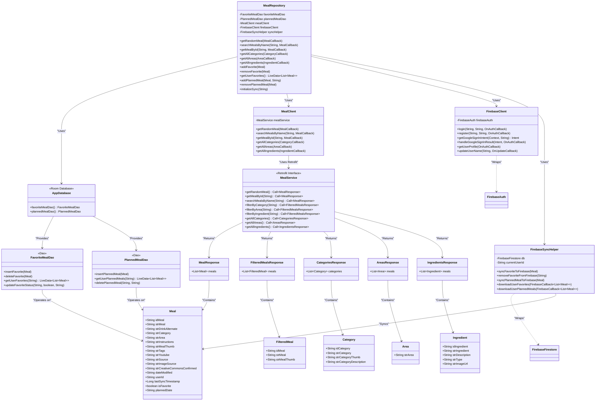
```mermaid

classDiagram
    direction TB

    %% ====================== Repository & Core ======================
    class MealRepository {
        -FavoriteMealDao favoriteMealDao
        -PlannedMealDao plannedMealDao
        -MealClient mealClient
        -FirebaseClient firebaseClient
        -FirebaseSyncHelper syncHelper
        +getRandomMeal(MealCallback)
        +searchMealsByName(String, MealCallback)
        +getMealById(String, MealCallback)
        +getAllCategories(CategoryCallback)
        +getAllAreas(AreaCallback)
        +getAllIngredients(IngredientCallback)
        +addFavorite(Meal)
        +removeFavorite(Meal)
        +getUserFavorites() LiveData~List~Meal~~
        +addPlannedMeal(Meal, String)
        +removePlannedMeal(Meal)
        +initializeSync(String)
    }

    %% ====================== Database Layer ======================
    class AppDatabase {
        <<Room Database>>
        +favoriteMealDao() FavoriteMealDao
        +plannedMealDao() PlannedMealDao
    }

    class FavoriteMealDao {
        <<Dao>>
        +insertFavorite(Meal)
        +deleteFavorite(Meal)
        +getUserFavorites(String) LiveData~List~Meal~~
        +updateFavoriteStatus(String, boolean, String)
    }

    class PlannedMealDao {
        <<Dao>>
        +insertPlannedMeal(Meal)
        +getUserPlannedMeals(String) LiveData~List~Meal~~
        +deletePlannedMeal(String, String)
    }

    %% ====================== Network Layer ======================
    class MealClient {
        -MealService mealService
        +getRandomMeal(MealCallback)
        +searchMealsByName(String, MealCallback)
        +getMealById(String, MealCallback)
        +getAllCategories(CategoryCallback)
        +getAllAreas(AreaCallback)
        +getAllIngredients(IngredientCallback)
    }

    class MealService {
        <<Retrofit Interface>>
        +getRandomMeal() Call~MealResponse~
        +getMealById(String) Call~MealResponse~
        +searchMealsByName(String) Call~MealResponse~
        +filterByCategory(String) Call~FilteredMealsResponse~
        +filterByArea(String) Call~FilteredMealsResponse~
        +filterByIngredient(String) Call~FilteredMealsResponse~
        +getAllCategories() Call~CategoriesResponse~
        +getAllAreas() Call~AreasResponse~
        +getAllIngredients() Call~IngredientsResponse~
    }

    %% ====================== Firebase Layer ======================
    class FirebaseClient {
        -FirebaseAuth firebaseAuth
        +login(String, String, OnAuthCallback)
        +register(String, String, OnAuthCallback)
        +getGoogleSignInIntent(Context, String) Intent
        +handleGoogleSignInResult(Intent, OnAuthCallback)
        +getUserProfile(OnAuthCallback)
        +updateUserName(String, OnUpdateCallback)
    }

    class FirebaseSyncHelper {
        -FirebaseFirestore db
        -String currentUserId
        +syncFavoriteToFirebase(Meal)
        +removeFavoriteFromFirebase(String)
        +syncPlannedMealToFirebase(Meal)
        +downloadUserFavorites(FirebaseCallback~List~Meal~~)
        +downloadUserPlannedMeals(FirebaseCallback~List~Meal~~)
    }

    %% ====================== Data Models ======================
    class Meal {
        +String idMeal
        +String strMeal
        +String strDrinkAlternate
        +String strCategory
        +String strArea
        +String strInstructions
        +String strMealThumb
        +String strTags
        +String strYoutube
        +String strSource
        +String strImageSource
        +String strCreativeCommonsConfirmed
        +String dateModified
        +String userId
        +Long lastSyncTimestamp
        +boolean isFavorite
        +String plannedDate
    }

    class FilteredMeal {
        +String idMeal
        +String strMeal
        +String strMealThumb
    }

    class Area {
        +String strArea
    }

    class Category {
        +String idCategory
        +String strCategory
        +String strCategoryThumb
        +String strCategoryDescription
    }

    class Ingredient {
        +String idIngredient
        +String strIngredient
        +String strDescription
        +String strType
        +String strImageUrl
    }

    %% ====================== API Responses ======================
    class MealResponse {
        +List~Meal~ meals
    }

    class FilteredMealsResponse {
        +List~FilteredMeal~ meals
    }

    class CategoriesResponse {
        +List~Category~ categories
    }

    class AreasResponse {
        +List~Area~ meals
    }

    class IngredientsResponse {
        +List~Ingredient~ meals
    }

    %% ====================== Relationships ======================
    MealRepository --> AppDatabase: "Uses"
    MealRepository --> MealClient: "Uses"
    MealRepository --> FirebaseClient: "Uses"
    MealRepository --> FirebaseSyncHelper: "Uses"

    AppDatabase --> FavoriteMealDao: "Provides"
    AppDatabase --> PlannedMealDao: "Provides"

    MealClient --> MealService: "Uses Retrofit"
    MealService --> MealResponse: "Returns"
    MealService --> FilteredMealsResponse: "Returns"
    MealService --> CategoriesResponse: "Returns"
    MealService --> AreasResponse: "Returns"
    MealService --> IngredientsResponse: "Returns"

    FavoriteMealDao --> Meal: "Operates on"
    PlannedMealDao --> Meal: "Operates on"

    FirebaseClient ..> FirebaseAuth: "Wraps"
    FirebaseSyncHelper ..> FirebaseFirestore: "Wraps"
    FirebaseSyncHelper --> Meal: "Syncs"

    %% Response Data Flow
    MealResponse --> Meal: "Contains"
    FilteredMealsResponse --> FilteredMeal: "Contains"
    CategoriesResponse --> Category: "Contains"
    AreasResponse --> Area: "Contains"
    IngredientsResponse --> Ingredient: "Contains"


```

## Main Activity
### Sequence Diagram

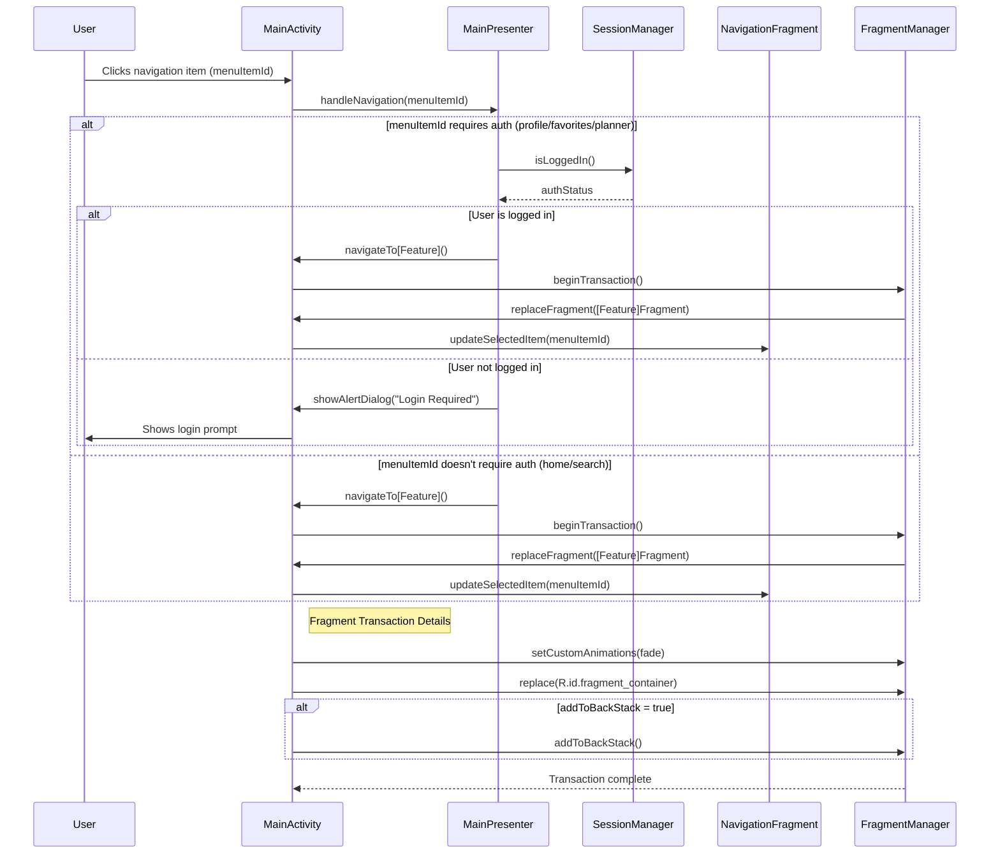
```mermaid

%%{init: {'theme': 'default', 'themeVariables': { 
  'background': '#ffffff',
  'primaryColor': '#ffffff',
  'actorBorder': '#333333',
  'actorTextColor': '#333333',
  'noteTextColor': '#333333',
  'signalColor': '#333333',
  'signalTextColor': '#333333',
  'sequenceNumberColor': '#333333',
  'fontFamily': '"Times New Roman", serif'
}}}%%

sequenceDiagram
    participant User
    participant MainActivity
    participant MainPresenter
    participant SessionManager
    participant NavigationFragment
    participant FragmentManager

    %% User selects a menu item
    User->>MainActivity: Clicks navigation item (menuItemId)
    MainActivity->>MainPresenter: handleNavigation(menuItemId)

    %% Check authentication
    alt menuItemId requires auth (profile/favorites/planner)
        MainPresenter->>SessionManager: isLoggedIn()
        SessionManager-->>MainPresenter: authStatus

        alt User is logged in
            MainPresenter->>MainActivity: navigateTo[Feature]()
            MainActivity->>FragmentManager: beginTransaction()
            FragmentManager->>MainActivity: replaceFragment([Feature]Fragment)
            MainActivity->>NavigationFragment: updateSelectedItem(menuItemId)
        else User not logged in
            MainPresenter->>MainActivity: showAlertDialog("Login Required")
            MainActivity->>User: Shows login prompt
        end
    else menuItemId doesn't require auth (home/search)
        MainPresenter->>MainActivity: navigateTo[Feature]()
        MainActivity->>FragmentManager: beginTransaction()
        FragmentManager->>MainActivity: replaceFragment([Feature]Fragment)
        MainActivity->>NavigationFragment: updateSelectedItem(menuItemId)
    end

    %% Fragment transition example
    Note right of MainActivity: Fragment Transaction Details
    MainActivity->>FragmentManager: setCustomAnimations(fade)
    MainActivity->>FragmentManager: replace(R.id.fragment_container)
    alt addToBackStack = true
        MainActivity->>FragmentManager: addToBackStack()
    end
    FragmentManager-->>MainActivity: Transaction complete

```

## Home Feature
### Sequence Diagram
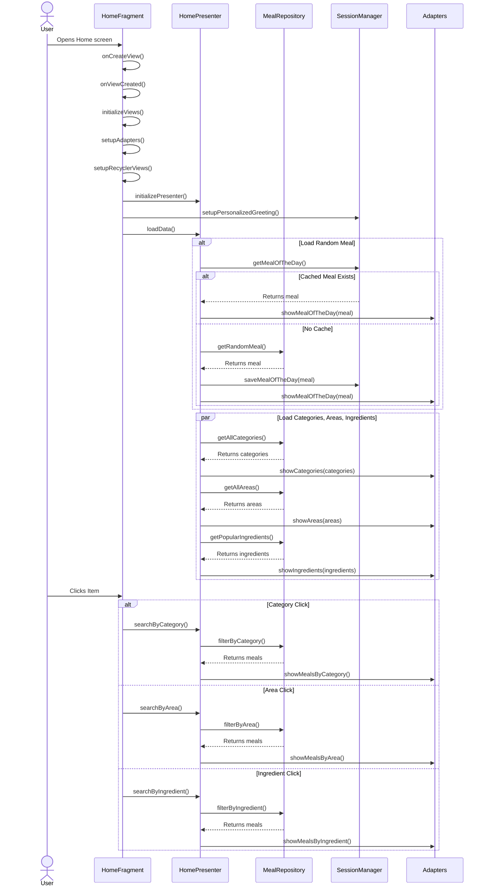
```mermaid
%%{init: {'theme': 'default', 'themeVariables': { 
  'background': '#ffffff',
  'primaryColor': '#ffffff',
  'actorBorder': '#333333',
  'actorTextColor': '#333333',
  'noteTextColor': '#333333',
  'signalColor': '#333333',
  'signalTextColor': '#333333',
  'sequenceNumberColor': '#333333',
  'fontFamily': '"Times New Roman", serif'
}}}%%
sequenceDiagram
    actor User
    participant HomeFragment
    participant HomePresenter
    participant MealRepository
    participant SessionManager
    participant Adapters
    
    User->>HomeFragment: Opens Home screen
    HomeFragment->>HomeFragment: onCreateView()
    HomeFragment->>HomeFragment: onViewCreated()
        HomeFragment->>HomeFragment: initializeViews()
        HomeFragment->>HomeFragment: setupAdapters()
        HomeFragment->>HomeFragment: setupRecyclerViews()
        HomeFragment->>HomePresenter: initializePresenter()
        HomeFragment->>SessionManager: setupPersonalizedGreeting()
        HomeFragment->>HomePresenter: loadData()
        
        alt Load Random Meal
            HomePresenter->>SessionManager: getMealOfTheDay()
            alt Cached Meal Exists
                SessionManager-->>HomePresenter: Returns meal
                HomePresenter->>Adapters: showMealOfTheDay(meal)
            else No Cache
                HomePresenter->>MealRepository: getRandomMeal()
                MealRepository-->>HomePresenter: Returns meal
                HomePresenter->>SessionManager: saveMealOfTheDay(meal)
                HomePresenter->>Adapters: showMealOfTheDay(meal)
            end
        end
        
        par Load Categories, Areas, Ingredients
            HomePresenter->>MealRepository: getAllCategories()
            MealRepository-->>HomePresenter: Returns categories
            HomePresenter->>Adapters: showCategories(categories)
            
            HomePresenter->>MealRepository: getAllAreas()
            MealRepository-->>HomePresenter: Returns areas
            HomePresenter->>Adapters: showAreas(areas)
            
            HomePresenter->>MealRepository: getPopularIngredients()
            MealRepository-->>HomePresenter: Returns ingredients
            HomePresenter->>Adapters: showIngredients(ingredients)
        end
    
    User->>HomeFragment: Clicks Item
    alt Category Click
        HomeFragment->>HomePresenter: searchByCategory()
        HomePresenter->>MealRepository: filterByCategory()
        MealRepository-->>HomePresenter: Returns meals
        HomePresenter->>Adapters: showMealsByCategory()
    else Area Click
        HomeFragment->>HomePresenter: searchByArea()
        HomePresenter->>MealRepository: filterByArea()
        MealRepository-->>HomePresenter: Returns meals
        HomePresenter->>Adapters: showMealsByArea()
    else Ingredient Click
        HomeFragment->>HomePresenter: searchByIngredient()
        HomePresenter->>MealRepository: filterByIngredient()
        MealRepository-->>HomePresenter: Returns meals
        HomePresenter->>Adapters: showMealsByIngredient()
    end
```

## Login Feature
### Sequence Diagram

```mermaid
%%{init: {'theme': 'default', 'themeVariables': { 
  'background': '#ffffff',
  'primaryColor': '#ffffff',
  'actorBorder': '#333333',
  'actorTextColor': '#333333',
  'noteTextColor': '#333333',
  'signalColor': '#333333',
  'signalTextColor': '#333333',
  'sequenceNumberColor': '#333333',
  'fontFamily': '"Times New Roman", serif'
}}}%%
sequenceDiagram
    actor User as User
    participant LoginActivity
    participant LoginPresenter
    participant MealRepository
    participant SessionManager
    participant FirebaseClient
    
    Note over User,FirebaseClient: Initialization Phase
    User->>LoginActivity: Launches Activity
    LoginActivity->>LoginPresenter: checkExistingSession()
    alt Existing Session Found
        LoginPresenter->>SessionManager: isLoggedIn()
        SessionManager-->>LoginPresenter: true
        LoginPresenter->>LoginActivity: onLoginSuccess()
        LoginActivity->>User: Navigates to Home
    else No Session
        Note right of User: User sees login screen
    end
    
    Note over User,FirebaseClient: Email/Password Login
    User->>LoginActivity: Enters credentials
    User->>LoginActivity: Clicks Login
    LoginActivity->>LoginPresenter: loginUser(email, pass)
    LoginPresenter->>LoginPresenter: validateCredentials()
    alt Invalid Credentials
        LoginPresenter->>LoginActivity: showEmailError()
        LoginPresenter->>LoginActivity: showPasswordError()
    else Valid Credentials
        LoginPresenter->>LoginActivity: showLoading()
        LoginPresenter->>MealRepository: login(email, pass)
        MealRepository->>FirebaseClient: authenticate()
        alt Success
            FirebaseClient-->>MealRepository: FirebaseUser
            MealRepository-->>LoginPresenter: onSuccess()
            LoginPresenter->>SessionManager: createLoginSession()
            LoginPresenter->>LoginActivity: hideLoading()
            LoginPresenter->>LoginActivity: onLoginSuccess()
            LoginActivity->>User: Navigates to Home
        else Failure
            FirebaseClient-->>MealRepository: Exception
            MealRepository-->>LoginPresenter: onFailure()
            LoginPresenter->>LoginActivity: hideLoading()
            LoginPresenter->>LoginActivity: onLoginFailure()
            LoginActivity->>User: Shows error
        end
    end
    
    Note over User,FirebaseClient: Google Sign-In
    User->>LoginActivity: Clicks Google
    LoginActivity->>LoginPresenter: handleGoogleSignInClick()
    LoginPresenter->>MealRepository: getGoogleSignInIntent()
    MealRepository-->>LoginPresenter: Intent
    LoginPresenter->>LoginActivity: startGoogleSignIn()
    LoginActivity->>User: Shows Google picker
    User->>LoginActivity: Selects account
    LoginActivity->>LoginPresenter: handleGoogleSignIn(data)
    LoginPresenter->>LoginActivity: showLoading()
    LoginPresenter->>MealRepository: handleGoogleSignInResult()
    MealRepository->>FirebaseClient: authenticateWithGoogle()
    alt Success
        FirebaseClient-->>MealRepository: FirebaseUser
        MealRepository-->>LoginPresenter: onSuccess()
        LoginPresenter->>SessionManager: createLoginSession()
        LoginPresenter->>LoginActivity: hideLoading()
        LoginPresenter->>LoginActivity: onLoginSuccess()
        LoginActivity->>User: Navigates to Home
    else Failure
        FirebaseClient-->>MealRepository: Exception
        MealRepository-->>LoginPresenter: onFailure()
        LoginPresenter->>LoginActivity: hideLoading()
        LoginPresenter->>LoginActivity: onLoginFailure()
        LoginActivity->>User: Shows error
    end
    
    Note over User,FirebaseClient: Facebook Login
    User->>LoginActivity: Clicks Facebook
    LoginActivity->>LoginPresenter: performFacebookLogin()
    LoginPresenter->>LoginActivity: showLoading()
    LoginPresenter->>LoginManager: logInWithReadPermissions()
    User->>LoginActivity: Completes FB auth
    LoginActivity->>LoginPresenter: onActivityResult()
    LoginPresenter->>MealRepository: handleFacebookResult()
    MealRepository->>FirebaseClient: authenticateWithFacebook()
    alt Success
        FirebaseClient-->>MealRepository: FirebaseUser
        MealRepository-->>LoginPresenter: onSuccess()
        LoginPresenter->>SessionManager: createLoginSession()
        LoginPresenter->>LoginActivity: hideLoading()
        LoginPresenter->>LoginActivity: onLoginSuccess()
        LoginActivity->>User: Navigates to Home
    else Failure
        FirebaseClient-->>MealRepository: Exception
        MealRepository-->>LoginPresenter: onFailure()
        LoginPresenter->>LoginActivity: hideLoading()
        LoginPresenter->>LoginActivity: onLoginFailure()
        LoginActivity->>User: Shows error
    end


```

## Registration Feature
### Sequence Diagram

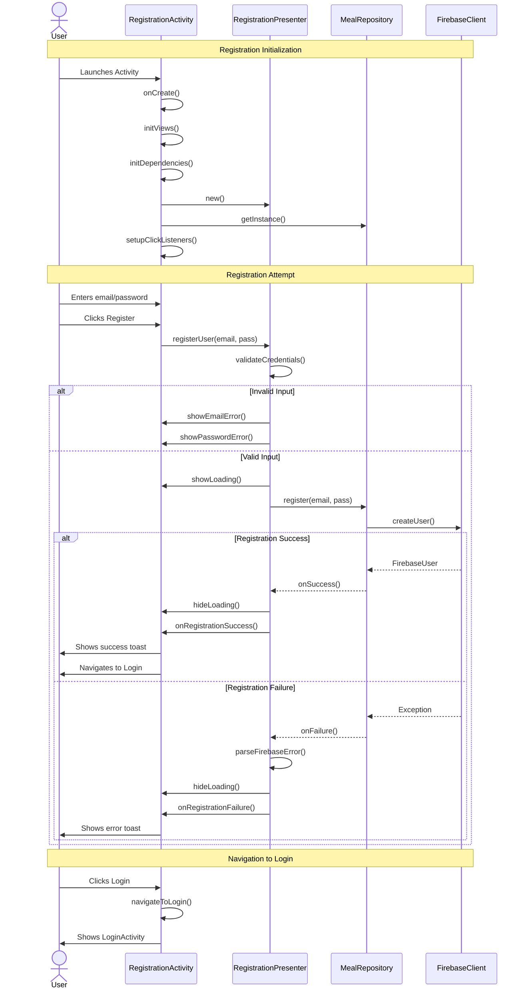
```mermaid

%%{init: {'theme': 'default', 'themeVariables': { 
  'background': '#ffffff',
  'primaryColor': '#ffffff',
  'actorBorder': '#333333',
  'actorTextColor': '#333333',
  'noteTextColor': '#333333',
  'signalColor': '#333333',
  'signalTextColor': '#333333',
  'sequenceNumberColor': '#333333',
  'fontFamily': '"Times New Roman", serif'
}}}%%
sequenceDiagram
    actor User as User
    participant RegistrationActivity
    participant RegistrationPresenter
    participant MealRepository
    participant FirebaseClient
    
    Note over User,FirebaseClient: Registration Initialization
    User->>RegistrationActivity: Launches Activity
    RegistrationActivity->>RegistrationActivity: onCreate()
        RegistrationActivity->>RegistrationActivity: initViews()
        RegistrationActivity->>RegistrationActivity: initDependencies()
        RegistrationActivity->>RegistrationPresenter: new()
        RegistrationActivity->>MealRepository: getInstance()
        RegistrationActivity->>RegistrationActivity: setupClickListeners()
    
    Note over User,FirebaseClient: Registration Attempt
    User->>RegistrationActivity: Enters email/password
    User->>RegistrationActivity: Clicks Register
    RegistrationActivity->>RegistrationPresenter: registerUser(email, pass)
    
    RegistrationPresenter->>RegistrationPresenter: validateCredentials()
    alt Invalid Input
        RegistrationPresenter->>RegistrationActivity: showEmailError()
        RegistrationPresenter->>RegistrationActivity: showPasswordError()
    else Valid Input
        RegistrationPresenter->>RegistrationActivity: showLoading()
        RegistrationPresenter->>MealRepository: register(email, pass)
        MealRepository->>FirebaseClient: createUser()
        
        alt Registration Success
            FirebaseClient-->>MealRepository: FirebaseUser
            MealRepository-->>RegistrationPresenter: onSuccess()
            RegistrationPresenter->>RegistrationActivity: hideLoading()
            RegistrationPresenter->>RegistrationActivity: onRegistrationSuccess()
            RegistrationActivity->>User: Shows success toast
            RegistrationActivity->>User: Navigates to Login
        else Registration Failure
            FirebaseClient-->>MealRepository: Exception
            MealRepository-->>RegistrationPresenter: onFailure()
            RegistrationPresenter->>RegistrationPresenter: parseFirebaseError()
            RegistrationPresenter->>RegistrationActivity: hideLoading()
            RegistrationPresenter->>RegistrationActivity: onRegistrationFailure()
            RegistrationActivity->>User: Shows error toast
        end
    end
    
    Note over User,FirebaseClient: Navigation to Login
    User->>RegistrationActivity: Clicks Login
    RegistrationActivity->>RegistrationActivity: navigateToLogin()
    RegistrationActivity->>User: Shows LoginActivity
```

## Favourite Feature
### Sequence Diagram

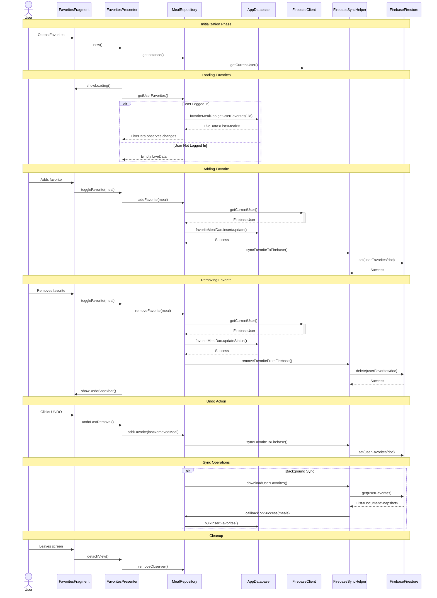
```mermaid

%%{init: {'theme': 'default', 'themeVariables': { 
  'background': '#ffffff',
  'primaryColor': '#ffffff',
  'actorBorder': '#333333',
  'actorTextColor': '#333333',
  'noteTextColor': '#333333',
  'signalColor': '#333333',
  'signalTextColor': '#333333',
  'sequenceNumberColor': '#333333',
  'fontFamily': '"Times New Roman", serif'
}}}%%
sequenceDiagram
    actor User as User
    participant FavoritesFragment
    participant FavoritesPresenter
    participant MealRepository
    participant AppDatabase
    participant FirebaseClient
    participant FirebaseSyncHelper
    participant FirebaseFirestore
    
    Note over User,FirebaseFirestore: Initialization Phase
    User->>FavoritesFragment: Opens Favorites
    FavoritesFragment->>FavoritesPresenter: new()
    FavoritesPresenter->>MealRepository: getInstance()
    MealRepository->>FirebaseClient: getCurrentUser()
    
    Note over User,FirebaseFirestore: Loading Favorites
    FavoritesPresenter->>FavoritesFragment: showLoading()
    FavoritesPresenter->>MealRepository: getUserFavorites()
    alt User Logged In
        MealRepository->>AppDatabase: favoriteMealDao.getUserFavorites(uid)
        AppDatabase-->>MealRepository: LiveData<List<Meal>>
        MealRepository-->>FavoritesPresenter: LiveData observes changes
    else User Not Logged In
        MealRepository-->>FavoritesPresenter: Empty LiveData
    end
    
    Note over User,FirebaseFirestore: Adding Favorite
    User->>FavoritesFragment: Adds favorite
    FavoritesFragment->>FavoritesPresenter: toggleFavorite(meal)
    FavoritesPresenter->>MealRepository: addFavorite(meal)
    MealRepository->>+FirebaseClient: getCurrentUser()
    FirebaseClient-->>-MealRepository: FirebaseUser
    MealRepository->>AppDatabase: favoriteMealDao.insert/update()
    AppDatabase-->>MealRepository: Success
    MealRepository->>FirebaseSyncHelper: syncFavoriteToFirebase()
    FirebaseSyncHelper->>FirebaseFirestore: set(userFavorites/doc)
    FirebaseFirestore-->>FirebaseSyncHelper: Success
    
    Note over User,FirebaseFirestore: Removing Favorite
    User->>FavoritesFragment: Removes favorite
    FavoritesFragment->>FavoritesPresenter: toggleFavorite(meal)
    FavoritesPresenter->>MealRepository: removeFavorite(meal)
    MealRepository->>+FirebaseClient: getCurrentUser()
    FirebaseClient-->>-MealRepository: FirebaseUser
    MealRepository->>AppDatabase: favoriteMealDao.updateStatus()
    AppDatabase-->>MealRepository: Success
    MealRepository->>FirebaseSyncHelper: removeFavoriteFromFirebase()
    FirebaseSyncHelper->>FirebaseFirestore: delete(userFavorites/doc)
    FirebaseFirestore-->>FirebaseSyncHelper: Success
    FavoritesPresenter->>FavoritesFragment: showUndoSnackbar()
    
    Note over User,FirebaseFirestore: Undo Action
    User->>FavoritesFragment: Clicks UNDO
    FavoritesFragment->>FavoritesPresenter: undoLastRemoval()
    FavoritesPresenter->>MealRepository: addFavorite(lastRemovedMeal)
    MealRepository->>FirebaseSyncHelper: syncFavoriteToFirebase()
    FirebaseSyncHelper->>FirebaseFirestore: set(userFavorites/doc)
    
    Note over User,FirebaseFirestore: Sync Operations
    alt Background Sync
        MealRepository->>FirebaseSyncHelper: downloadUserFavorites()
        FirebaseSyncHelper->>FirebaseFirestore: get(userFavorites)
        FirebaseFirestore-->>FirebaseSyncHelper: List<DocumentSnapshot>
        FirebaseSyncHelper->>MealRepository: callback.onSuccess(meals)
        MealRepository->>AppDatabase: bulkInsertFavorites()
    end
    
    Note over User,FirebaseFirestore: Cleanup
    User->>FavoritesFragment: Leaves screen
    FavoritesFragment->>FavoritesPresenter: detachView()
    FavoritesPresenter->>MealRepository: removeObserver()


```
## Planner Feature
### Sequence Diagram

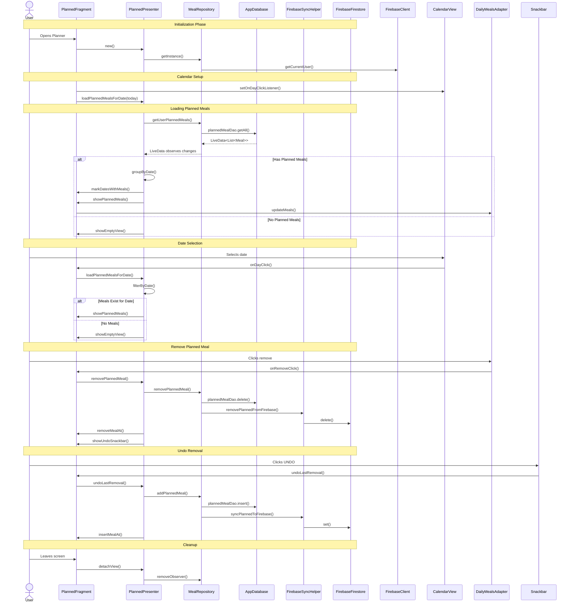
```mermaid
%%{init: {'theme': 'default', 'themeVariables': { 
  'background': '#ffffff',
  'primaryColor': '#ffffff',
  'actorBorder': '#333333',
  'actorTextColor': '#333333',
  'noteTextColor': '#333333',
  'signalColor': '#333333',
  'signalTextColor': '#333333',
  'sequenceNumberColor': '#333333',
  'fontFamily': '"Times New Roman", serif'
}}}%%
sequenceDiagram
    actor User as User
    participant PlannedFragment
    participant PlannedPresenter
    participant MealRepository
    participant AppDatabase
    participant FirebaseSyncHelper
    participant FirebaseFirestore
    
    Note over User,FirebaseFirestore: Initialization Phase
    User->>PlannedFragment: Opens Planner
    PlannedFragment->>PlannedPresenter: new()
    PlannedPresenter->>MealRepository: getInstance()
    MealRepository->>FirebaseClient: getCurrentUser()
    
    Note over User,FirebaseFirestore: Calendar Setup
    PlannedFragment->>CalendarView: setOnDayClickListener()
    PlannedFragment->>PlannedPresenter: loadPlannedMealsForDate(today)
    
    Note over User,FirebaseFirestore: Loading Planned Meals
    PlannedPresenter->>MealRepository: getUserPlannedMeals()
    MealRepository->>AppDatabase: plannedMealDao.getAll()
    AppDatabase-->>MealRepository: LiveData<List<Meal>>
    MealRepository-->>PlannedPresenter: LiveData observes changes
    
    alt Has Planned Meals
        PlannedPresenter->>PlannedPresenter: groupByDate()
        PlannedPresenter->>PlannedFragment: markDatesWithMeals()
        PlannedPresenter->>PlannedFragment: showPlannedMeals()
        PlannedFragment->>DailyMealsAdapter: updateMeals()
    else No Planned Meals
        PlannedPresenter->>PlannedFragment: showEmptyView()
    end
    
    Note over User,FirebaseFirestore: Date Selection
    User->>CalendarView: Selects date
    CalendarView->>PlannedFragment: onDayClick()
    PlannedFragment->>PlannedPresenter: loadPlannedMealsForDate()
    PlannedPresenter->>PlannedPresenter: filterByDate()
    alt Meals Exist for Date
        PlannedPresenter->>PlannedFragment: showPlannedMeals()
    else No Meals
        PlannedPresenter->>PlannedFragment: showEmptyView()
    end
    
    Note over User,FirebaseFirestore: Remove Planned Meal
    User->>DailyMealsAdapter: Clicks remove
    DailyMealsAdapter->>PlannedFragment: onRemoveClick()
    PlannedFragment->>PlannedPresenter: removePlannedMeal()
    PlannedPresenter->>MealRepository: removePlannedMeal()
    MealRepository->>AppDatabase: plannedMealDao.delete()
    MealRepository->>FirebaseSyncHelper: removePlannedFromFirebase()
    FirebaseSyncHelper->>FirebaseFirestore: delete()
    PlannedPresenter->>PlannedFragment: removeMealAt()
    PlannedPresenter->>PlannedFragment: showUndoSnackbar()
    
    Note over User,FirebaseFirestore: Undo Removal
    User->>Snackbar: Clicks UNDO
    Snackbar->>PlannedFragment: undoLastRemoval()
    PlannedFragment->>PlannedPresenter: undoLastRemoval()
    PlannedPresenter->>MealRepository: addPlannedMeal()
    MealRepository->>AppDatabase: plannedMealDao.insert()
    MealRepository->>FirebaseSyncHelper: syncPlannedToFirebase()
    FirebaseSyncHelper->>FirebaseFirestore: set()
    PlannedPresenter->>PlannedFragment: insertMealAt()
    
    Note over User,FirebaseFirestore: Cleanup
    User->>PlannedFragment: Leaves screen
    PlannedFragment->>PlannedPresenter: detachView()
    PlannedPresenter->>MealRepository: removeObserver()

```

# Meal Detail Feature
## Sequence Diagram

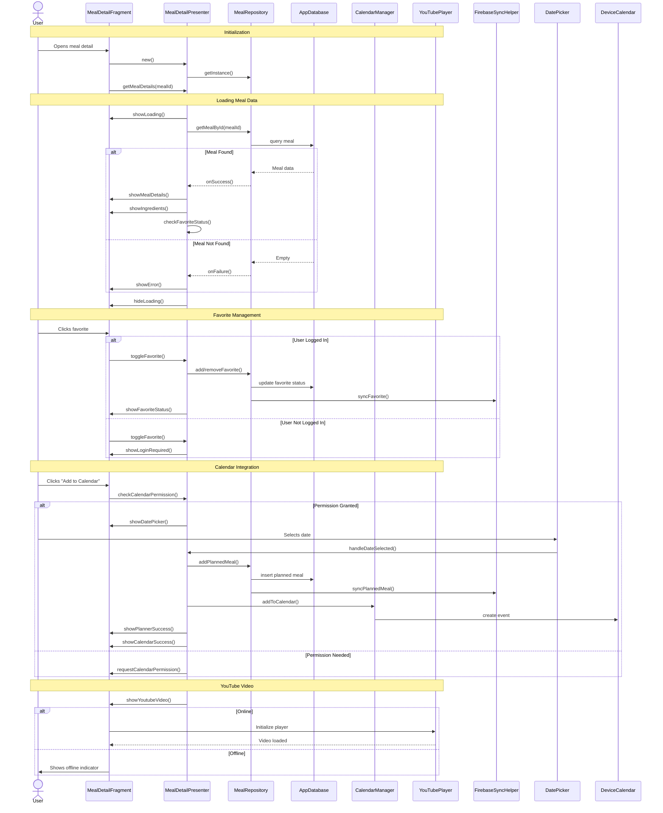
```mermaid
%%{init: {'theme': 'default', 'themeVariables': { 
  'background': '#ffffff',
  'primaryColor': '#ffffff',
  'actorBorder': '#333333',
  'actorTextColor': '#333333',
  'noteTextColor': '#333333',
  'signalColor': '#333333',
  'signalTextColor': '#333333',
  'sequenceNumberColor': '#333333',
  'fontFamily': '"Times New Roman", serif'
}}}%%
sequenceDiagram
    actor User as User
    participant MealDetailFragment
    participant MealDetailPresenter
    participant MealRepository
    participant AppDatabase
    participant CalendarManager
    participant YouTubePlayer
    
    Note over User,YouTubePlayer: Initialization
    User->>MealDetailFragment: Opens meal detail
    MealDetailFragment->>MealDetailPresenter: new()
    MealDetailPresenter->>MealRepository: getInstance()
    MealDetailFragment->>MealDetailPresenter: getMealDetails(mealId)
    
    Note over User,YouTubePlayer: Loading Meal Data
    MealDetailPresenter->>MealDetailFragment: showLoading()
    MealDetailPresenter->>MealRepository: getMealById(mealId)
    MealRepository->>AppDatabase: query meal
    alt Meal Found
        AppDatabase-->>MealRepository: Meal data
        MealRepository-->>MealDetailPresenter: onSuccess()
        MealDetailPresenter->>MealDetailFragment: showMealDetails()
        MealDetailPresenter->>MealDetailFragment: showIngredients()
        MealDetailPresenter->>MealDetailPresenter: checkFavoriteStatus()
    else Meal Not Found
        AppDatabase-->>MealRepository: Empty
        MealRepository-->>MealDetailPresenter: onFailure()
        MealDetailPresenter->>MealDetailFragment: showError()
    end
    MealDetailPresenter->>MealDetailFragment: hideLoading()
    
    Note over User,YouTubePlayer: Favorite Management
    User->>MealDetailFragment: Clicks favorite
    alt User Logged In
        MealDetailFragment->>MealDetailPresenter: toggleFavorite()
        MealDetailPresenter->>MealRepository: add/removeFavorite()
        MealRepository->>AppDatabase: update favorite status
        MealRepository->>FirebaseSyncHelper: syncFavorite()
        MealDetailPresenter->>MealDetailFragment: showFavoriteStatus()
    else User Not Logged In
        MealDetailFragment->>MealDetailPresenter: toggleFavorite()
        MealDetailPresenter->>MealDetailFragment: showLoginRequired()
    end
    
    Note over User,YouTubePlayer: Calendar Integration
    User->>MealDetailFragment: Clicks "Add to Calendar"
    MealDetailFragment->>MealDetailPresenter: checkCalendarPermission()
    alt Permission Granted
        MealDetailPresenter->>MealDetailFragment: showDatePicker()
        User->>DatePicker: Selects date
        DatePicker->>MealDetailPresenter: handleDateSelected()
        MealDetailPresenter->>MealRepository: addPlannedMeal()
        MealRepository->>AppDatabase: insert planned meal
        MealRepository->>FirebaseSyncHelper: syncPlannedMeal()
        MealDetailPresenter->>CalendarManager: addToCalendar()
        CalendarManager->>DeviceCalendar: create event
        MealDetailPresenter->>MealDetailFragment: showPlannerSuccess()
        MealDetailPresenter->>MealDetailFragment: showCalendarSuccess()
    else Permission Needed
        MealDetailPresenter->>MealDetailFragment: requestCalendarPermission()
    end
    
    Note over User,YouTubePlayer: YouTube Video
    MealDetailPresenter->>MealDetailFragment: showYoutubeVideo()
    alt Online
        MealDetailFragment->>YouTubePlayer: Initialize player
        YouTubePlayer-->>MealDetailFragment: Video loaded
    else Offline
        MealDetailFragment->>User: Shows offline indicator
    end

```

# Navigation System 

## Architecture Overview
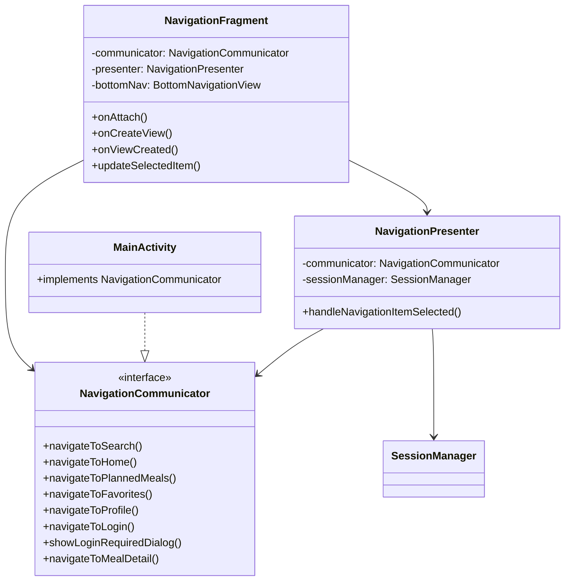
```mermaid
%%{init: {'theme': 'default', 'themeVariables': { 
  'background': '#ffffff',
  'primaryColor': '#ffffff',
  'actorBorder': '#333333',
  'actorTextColor': '#333333',
  'noteTextColor': '#333333',
  'signalColor': '#333333',
  'signalTextColor': '#333333',
  'sequenceNumberColor': '#333333',
  'fontFamily': '"Times New Roman", serif'
}}}%%
classDiagram
    class NavigationCommunicator {
        <<interface>>
        +navigateToSearch()
        +navigateToHome()
        +navigateToPlannedMeals()
        +navigateToFavorites()
        +navigateToProfile()
        +navigateToLogin()
        +showLoginRequiredDialog()
        +navigateToMealDetail()
    }

    class NavigationFragment {
        -communicator: NavigationCommunicator
        -presenter: NavigationPresenter
        -bottomNav: BottomNavigationView
        +onAttach()
        +onCreateView()
        +onViewCreated()
        +updateSelectedItem()
    }

    class NavigationPresenter {
        -communicator: NavigationCommunicator
        -sessionManager: SessionManager
        +handleNavigationItemSelected()
    }

    class MainActivity {
        +implements NavigationCommunicator
    }

    NavigationFragment --> NavigationCommunicator
    NavigationFragment --> NavigationPresenter
    NavigationPresenter --> NavigationCommunicator
    NavigationPresenter --> SessionManager
    MainActivity ..|> NavigationCommunicator

```

## Sequence Diagram
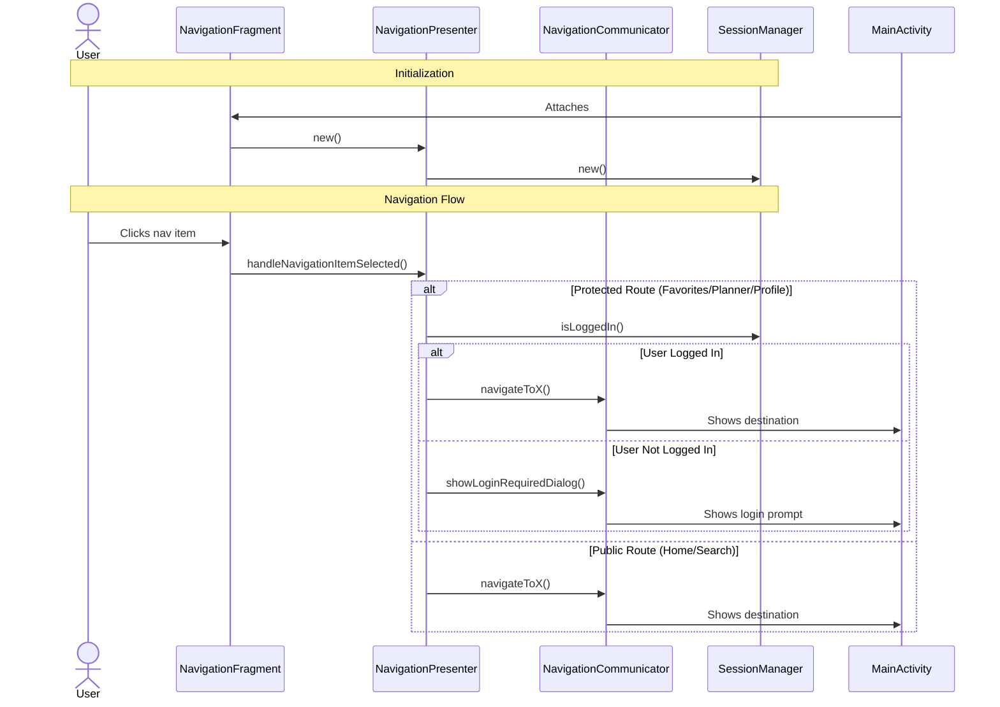
```mermaid
%%{init: {'theme': 'default', 'themeVariables': { 
  'background': '#ffffff',
  'primaryColor': '#ffffff',
  'actorBorder': '#333333',
  'actorTextColor': '#333333',
  'noteTextColor': '#333333',
  'signalColor': '#333333',
  'signalTextColor': '#333333',
  'sequenceNumberColor': '#333333',
  'fontFamily': '"Times New Roman", serif'
}}}%%
sequenceDiagram
    actor User as User
    participant NavigationFragment
    participant NavigationPresenter
    participant NavigationCommunicator
    participant SessionManager
    
    Note over User,SessionManager: Initialization
    MainActivity->>NavigationFragment: Attaches
    NavigationFragment->>NavigationPresenter: new()
    NavigationPresenter->>SessionManager: new()
    
    Note over User,SessionManager: Navigation Flow
    User->>NavigationFragment: Clicks nav item
    NavigationFragment->>NavigationPresenter: handleNavigationItemSelected()
    
    alt Protected Route (Favorites/Planner/Profile)
        NavigationPresenter->>SessionManager: isLoggedIn()
        alt User Logged In
            NavigationPresenter->>NavigationCommunicator: navigateToX()
            NavigationCommunicator->>MainActivity: Shows destination
        else User Not Logged In
            NavigationPresenter->>NavigationCommunicator: showLoginRequiredDialog()
            NavigationCommunicator->>MainActivity: Shows login prompt
        end
    else Public Route (Home/Search)
        NavigationPresenter->>NavigationCommunicator: navigateToX()
        NavigationCommunicator->>MainActivity: Shows destination
    end


```

# Network Status & Caching System 

## Architecture Overview
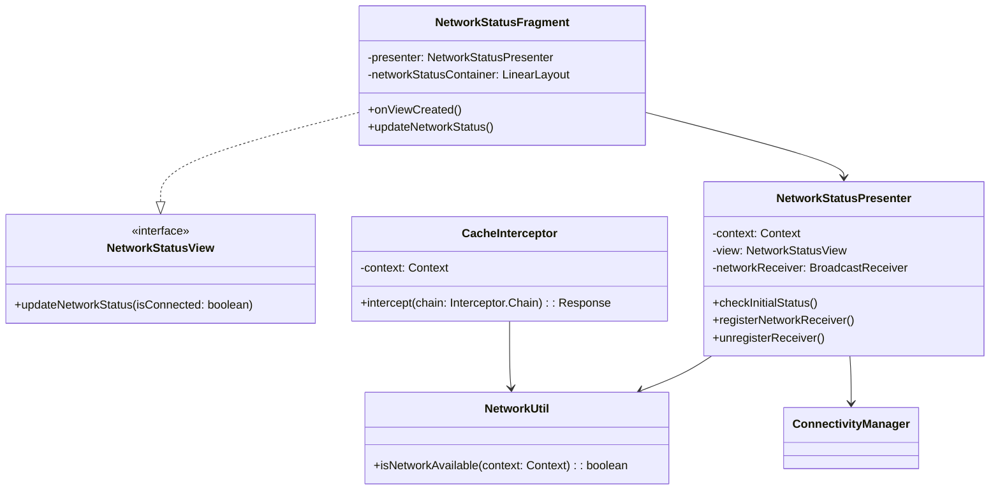
```mermaid
%%{init: {'theme': 'default', 'themeVariables': { 
  'background': '#ffffff',
  'primaryColor': '#ffffff',
  'actorBorder': '#333333',
  'actorTextColor': '#333333',
  'noteTextColor': '#333333',
  'signalColor': '#333333',
  'signalTextColor': '#333333',
  'sequenceNumberColor': '#333333',
  'fontFamily': '"Times New Roman", serif'
}}}%%
classDiagram
    class NetworkStatusView {
        <<interface>>
        +updateNetworkStatus(isConnected: boolean)
    }

    class NetworkStatusFragment {
        -presenter: NetworkStatusPresenter
        -networkStatusContainer: LinearLayout
        +onViewCreated()
        +updateNetworkStatus()
    }

    class NetworkStatusPresenter {
        -context: Context
        -view: NetworkStatusView
        -networkReceiver: BroadcastReceiver
        +checkInitialStatus()
        +registerNetworkReceiver()
        +unregisterReceiver()
    }

    class NetworkUtil {
        +isNetworkAvailable(context: Context): boolean
    }

    class CacheInterceptor {
        -context: Context
        +intercept(chain: Interceptor.Chain): Response
    }

    NetworkStatusFragment ..|> NetworkStatusView
    NetworkStatusFragment --> NetworkStatusPresenter
    NetworkStatusPresenter --> NetworkUtil
    NetworkStatusPresenter --> ConnectivityManager
    CacheInterceptor --> NetworkUtil
```

## Sequence Diagram
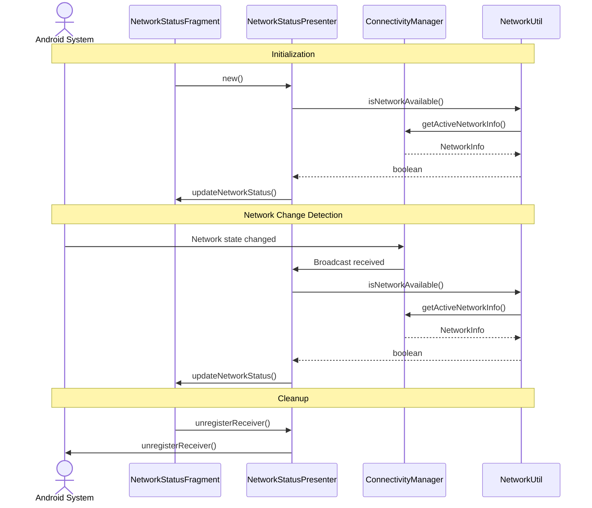
```mermaid
%%{init: {'theme': 'default', 'themeVariables': { 
  'background': '#ffffff',
  'primaryColor': '#ffffff',
  'actorBorder': '#333333',
  'actorTextColor': '#333333',
  'noteTextColor': '#333333',
  'signalColor': '#333333',
  'signalTextColor': '#333333',
  'sequenceNumberColor': '#333333',
  'fontFamily': '"Times New Roman", serif'
}}}%%
sequenceDiagram
    actor System as Android System
    participant NetworkStatusFragment
    participant NetworkStatusPresenter
    participant ConnectivityManager
    participant NetworkUtil
    
    Note over System,NetworkUtil: Initialization
    NetworkStatusFragment->>NetworkStatusPresenter: new()
    NetworkStatusPresenter->>NetworkUtil: isNetworkAvailable()
    NetworkUtil->>ConnectivityManager: getActiveNetworkInfo()
    ConnectivityManager-->>NetworkUtil: NetworkInfo
    NetworkUtil-->>NetworkStatusPresenter: boolean
    NetworkStatusPresenter->>NetworkStatusFragment: updateNetworkStatus()
    
    Note over System,NetworkUtil: Network Change Detection
    System->>ConnectivityManager: Network state changed
    ConnectivityManager->>NetworkStatusPresenter: Broadcast received
    NetworkStatusPresenter->>NetworkUtil: isNetworkAvailable()
    NetworkUtil->>ConnectivityManager: getActiveNetworkInfo()
    ConnectivityManager-->>NetworkUtil: NetworkInfo
    NetworkUtil-->>NetworkStatusPresenter: boolean
    NetworkStatusPresenter->>NetworkStatusFragment: updateNetworkStatus()
    
    Note over System,NetworkUtil: Cleanup
    NetworkStatusFragment->>NetworkStatusPresenter: unregisterReceiver()
    NetworkStatusPresenter->>System: unregisterReceiver()
```

# Session Manager 

## Architecture Overview
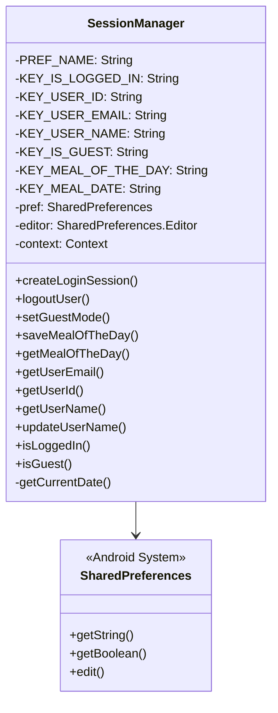
```mermaid
%%{init: {'theme': 'default', 'themeVariables': { 
  'background': '#ffffff',
  'primaryColor': '#ffffff',
  'actorBorder': '#333333',
  'actorTextColor': '#333333',
  'noteTextColor': '#333333',
  'signalColor': '#333333',
  'signalTextColor': '#333333',
  'sequenceNumberColor': '#333333',
  'fontFamily': '"Times New Roman", serif'
}}}%%
classDiagram
    class SessionManager {
        -PREF_NAME: String
        -KEY_IS_LOGGED_IN: String
        -KEY_USER_ID: String
        -KEY_USER_EMAIL: String
        -KEY_USER_NAME: String
        -KEY_IS_GUEST: String
        -KEY_MEAL_OF_THE_DAY: String
        -KEY_MEAL_DATE: String
        -pref: SharedPreferences
        -editor: SharedPreferences.Editor
        -context: Context
        +createLoginSession()
        +logoutUser()
        +setGuestMode()
        +saveMealOfTheDay()
        +getMealOfTheDay()
        +getUserEmail()
        +getUserId()
        +getUserName()
        +updateUserName()
        +isLoggedIn()
        +isGuest()
        -getCurrentDate()
    }

    class SharedPreferences {
        <<Android System>>
        +getString()
        +getBoolean()
        +edit()
    }

    SessionManager --> SharedPreferences

```

## Sequence Diagram
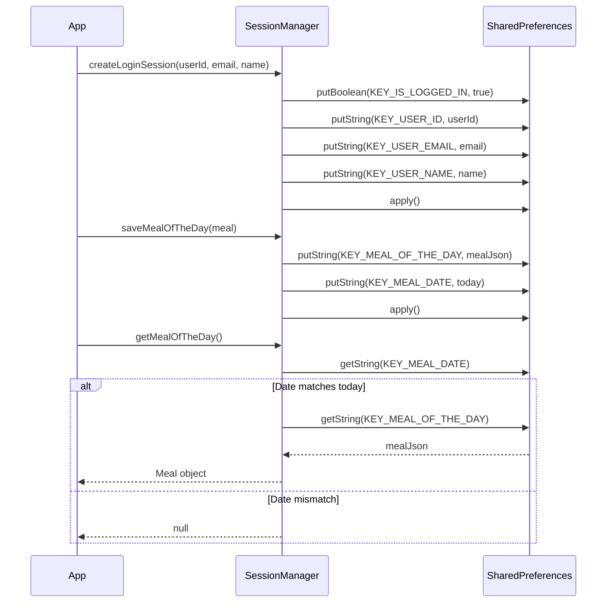
```mermaid
sequenceDiagram
    participant App
    participant SessionManager
    participant SharedPreferences
    
    App->>SessionManager: createLoginSession(userId, email, name)
    SessionManager->>SharedPreferences: putBoolean(KEY_IS_LOGGED_IN, true)
    SessionManager->>SharedPreferences: putString(KEY_USER_ID, userId)
    SessionManager->>SharedPreferences: putString(KEY_USER_EMAIL, email)
    SessionManager->>SharedPreferences: putString(KEY_USER_NAME, name)
    SessionManager->>SharedPreferences: apply()
    
    App->>SessionManager: saveMealOfTheDay(meal)
    SessionManager->>SharedPreferences: putString(KEY_MEAL_OF_THE_DAY, mealJson)
    SessionManager->>SharedPreferences: putString(KEY_MEAL_DATE, today)
    SessionManager->>SharedPreferences: apply()
    
    App->>SessionManager: getMealOfTheDay()
    SessionManager->>SharedPreferences: getString(KEY_MEAL_DATE)
    alt Date matches today
        SessionManager->>SharedPreferences: getString(KEY_MEAL_OF_THE_DAY)
        SharedPreferences-->>SessionManager: mealJson
        SessionManager-->>App: Meal object
    else Date mismatch
        SessionManager-->>App: null
    end

```

# Profile Feature 

## Architecture Overview
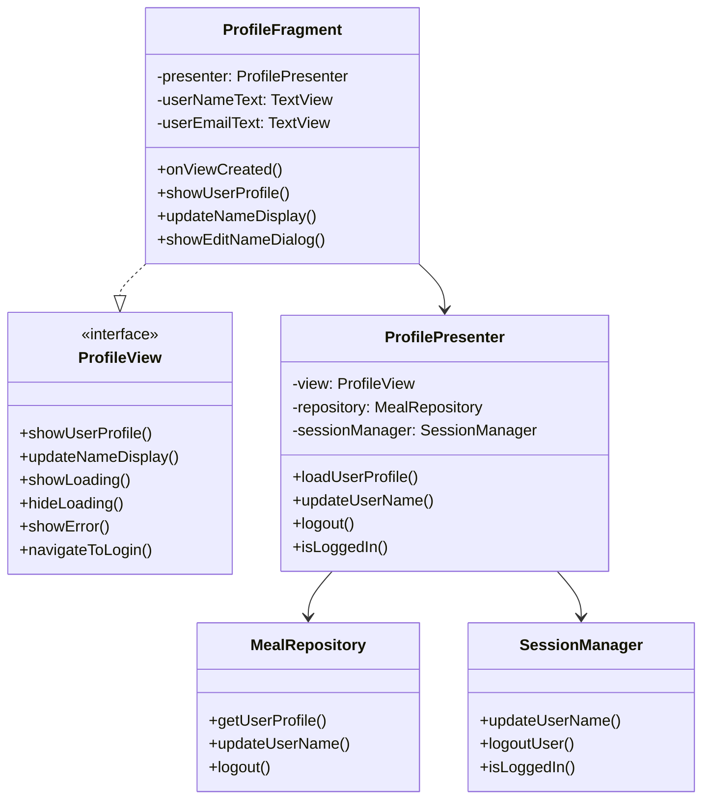
```mermaid
%%{init: {'theme': 'default', 'themeVariables': { 
  'background': '#ffffff',
  'primaryColor': '#ffffff',
  'actorBorder': '#333333',
  'actorTextColor': '#333333',
  'noteTextColor': '#333333',
  'signalColor': '#333333',
  'signalTextColor': '#333333',
  'sequenceNumberColor': '#333333',
  'fontFamily': '"Times New Roman", serif'
}}}%%
classDiagram
    class ProfileView {
        <<interface>>
        +showUserProfile()
        +updateNameDisplay()
        +showLoading()
        +hideLoading()
        +showError()
        +navigateToLogin()
    }

    class ProfileFragment {
        -presenter: ProfilePresenter
        -userNameText: TextView
        -userEmailText: TextView
        +onViewCreated()
        +showUserProfile()
        +updateNameDisplay()
        +showEditNameDialog()
    }

    class ProfilePresenter {
        -view: ProfileView
        -repository: MealRepository
        -sessionManager: SessionManager
        +loadUserProfile()
        +updateUserName()
        +logout()
        +isLoggedIn()
    }

    class MealRepository {
        +getUserProfile()
        +updateUserName()
        +logout()
    }

    class SessionManager {
        +updateUserName()
        +logoutUser()
        +isLoggedIn()
    }

    ProfileFragment ..|> ProfileView
    ProfileFragment --> ProfilePresenter
    ProfilePresenter --> MealRepository
    ProfilePresenter --> SessionManager

```

## Sequence Diagram
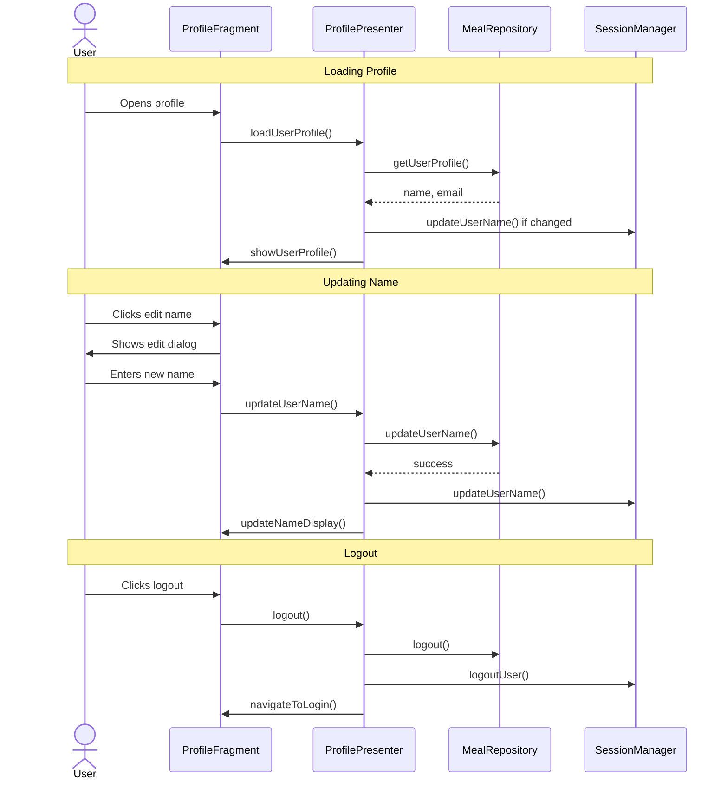
```mermaid

%%{init: {'theme': 'default', 'themeVariables': { 
  'background': '#ffffff',
  'primaryColor': '#ffffff',
  'actorBorder': '#333333',
  'actorTextColor': '#333333',
  'noteTextColor': '#333333',
  'signalColor': '#333333',
  'signalTextColor': '#333333',
  'sequenceNumberColor': '#333333',
  'fontFamily': '"Times New Roman", serif'
}}}%%
sequenceDiagram
    actor User as User
    participant ProfileFragment
    participant ProfilePresenter
    participant MealRepository
    participant SessionManager
    
    Note over User,SessionManager: Loading Profile
    User->>ProfileFragment: Opens profile
    ProfileFragment->>ProfilePresenter: loadUserProfile()
    ProfilePresenter->>MealRepository: getUserProfile()
    MealRepository-->>ProfilePresenter: name, email
    ProfilePresenter->>SessionManager: updateUserName() if changed
    ProfilePresenter->>ProfileFragment: showUserProfile()
    
    Note over User,SessionManager: Updating Name
    User->>ProfileFragment: Clicks edit name
    ProfileFragment->>User: Shows edit dialog
    User->>ProfileFragment: Enters new name
    ProfileFragment->>ProfilePresenter: updateUserName()
    ProfilePresenter->>MealRepository: updateUserName()
    MealRepository-->>ProfilePresenter: success
    ProfilePresenter->>SessionManager: updateUserName()
    ProfilePresenter->>ProfileFragment: updateNameDisplay()
    
    Note over User,SessionManager: Logout
    User->>ProfileFragment: Clicks logout
    ProfileFragment->>ProfilePresenter: logout()
    ProfilePresenter->>MealRepository: logout()
    ProfilePresenter->>SessionManager: logoutUser()
    ProfilePresenter->>ProfileFragment: navigateToLogin()
```

# Search Feature 

## Architecture Overview
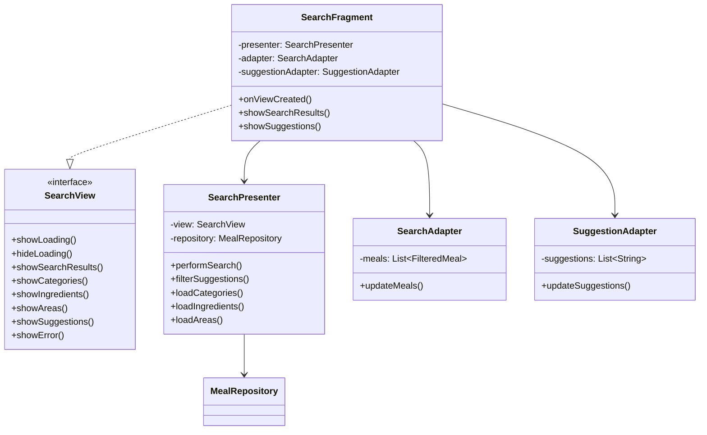
```mermaid
%%{init: {'theme': 'default', 'themeVariables': { 
  'background': '#ffffff',
  'primaryColor': '#ffffff',
  'actorBorder': '#333333',
  'actorTextColor': '#333333',
  'noteTextColor': '#333333',
  'signalColor': '#333333',
  'signalTextColor': '#333333',
  'sequenceNumberColor': '#333333',
  'fontFamily': '"Times New Roman", serif'
}}}%%
classDiagram
    class SearchView {
        <<interface>>
        +showLoading()
        +hideLoading()
        +showSearchResults()
        +showCategories()
        +showIngredients()
        +showAreas()
        +showSuggestions()
        +showError()
    }

    class SearchFragment {
        -presenter: SearchPresenter
        -adapter: SearchAdapter
        -suggestionAdapter: SuggestionAdapter
        +onViewCreated()
        +showSearchResults()
        +showSuggestions()
    }

    class SearchPresenter {
        -view: SearchView
        -repository: MealRepository
        +performSearch()
        +filterSuggestions()
        +loadCategories()
        +loadIngredients()
        +loadAreas()
    }

    class SearchAdapter {
        -meals: List~FilteredMeal~
        +updateMeals()
    }

    class SuggestionAdapter {
        -suggestions: List~String~
        +updateSuggestions()
    }

    SearchFragment ..|> SearchView
    SearchFragment --> SearchPresenter
    SearchFragment --> SearchAdapter
    SearchFragment --> SuggestionAdapter
    SearchPresenter --> MealRepository
```

## Sequence Diagram
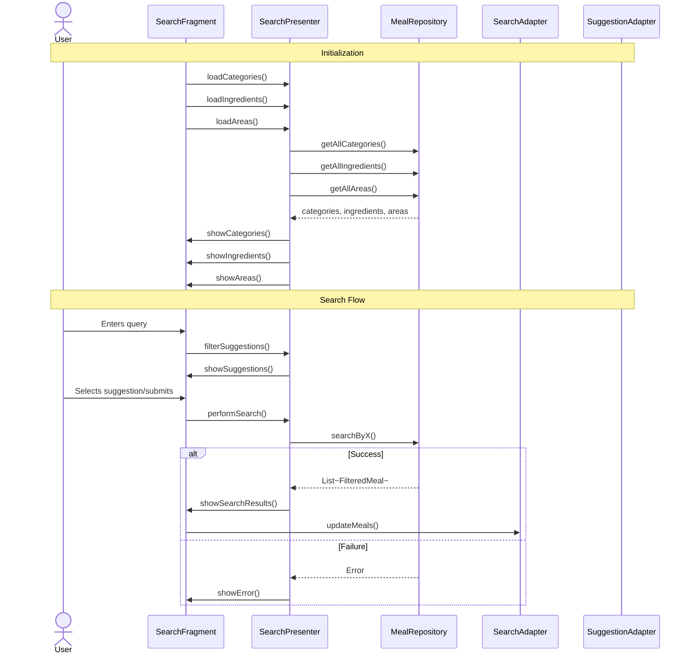
```mermaid

%%{init: {'theme': 'default', 'themeVariables': { 
  'background': '#ffffff',
  'primaryColor': '#ffffff',
  'actorBorder': '#333333',
  'actorTextColor': '#333333',
  'noteTextColor': '#333333',
  'signalColor': '#333333',
  'signalTextColor': '#333333',
  'sequenceNumberColor': '#333333',
  'fontFamily': '"Times New Roman", serif'
}}}%%
sequenceDiagram
    actor User as User
    participant SearchFragment
    participant SearchPresenter
    participant MealRepository
    participant SearchAdapter
    participant SuggestionAdapter
    
    Note over User,SuggestionAdapter: Initialization
    SearchFragment->>SearchPresenter: loadCategories()
    SearchFragment->>SearchPresenter: loadIngredients()
    SearchFragment->>SearchPresenter: loadAreas()
    SearchPresenter->>MealRepository: getAllCategories()
    SearchPresenter->>MealRepository: getAllIngredients()
    SearchPresenter->>MealRepository: getAllAreas()
    MealRepository-->>SearchPresenter: categories, ingredients, areas
    SearchPresenter->>SearchFragment: showCategories()
    SearchPresenter->>SearchFragment: showIngredients()
    SearchPresenter->>SearchFragment: showAreas()
    
    Note over User,SuggestionAdapter: Search Flow
    User->>SearchFragment: Enters query
    SearchFragment->>SearchPresenter: filterSuggestions()
    SearchPresenter->>SearchFragment: showSuggestions()
    User->>SearchFragment: Selects suggestion/submits
    SearchFragment->>SearchPresenter: performSearch()
    SearchPresenter->>MealRepository: searchByX()
    alt Success
        MealRepository-->>SearchPresenter: List~FilteredMeal~
        SearchPresenter->>SearchFragment: showSearchResults()
        SearchFragment->>SearchAdapter: updateMeals()
    else Failure
        MealRepository-->>SearchPresenter: Error
        SearchPresenter->>SearchFragment: showError()
    end
```

